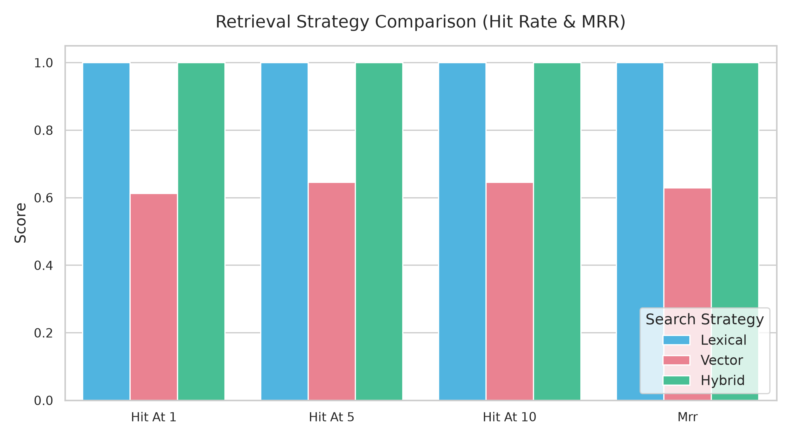
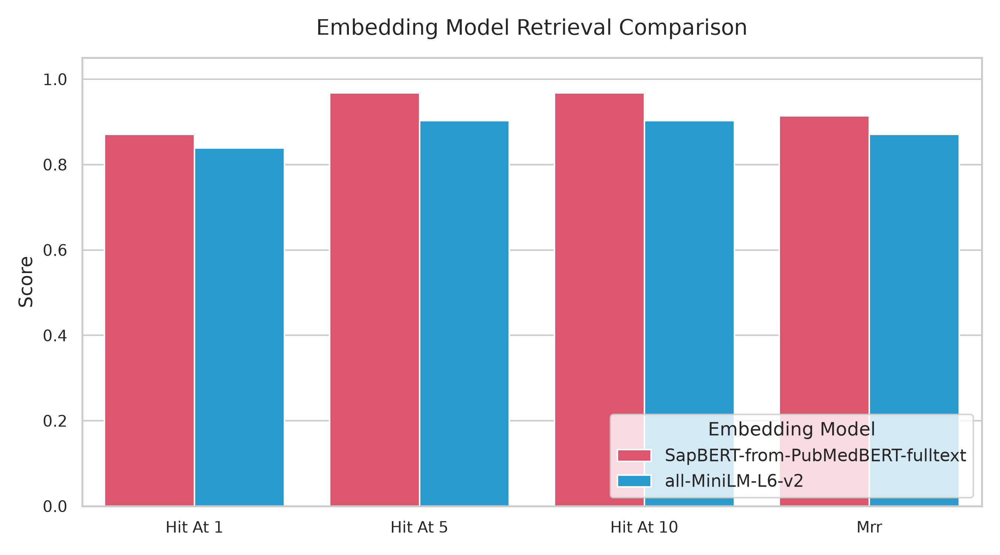
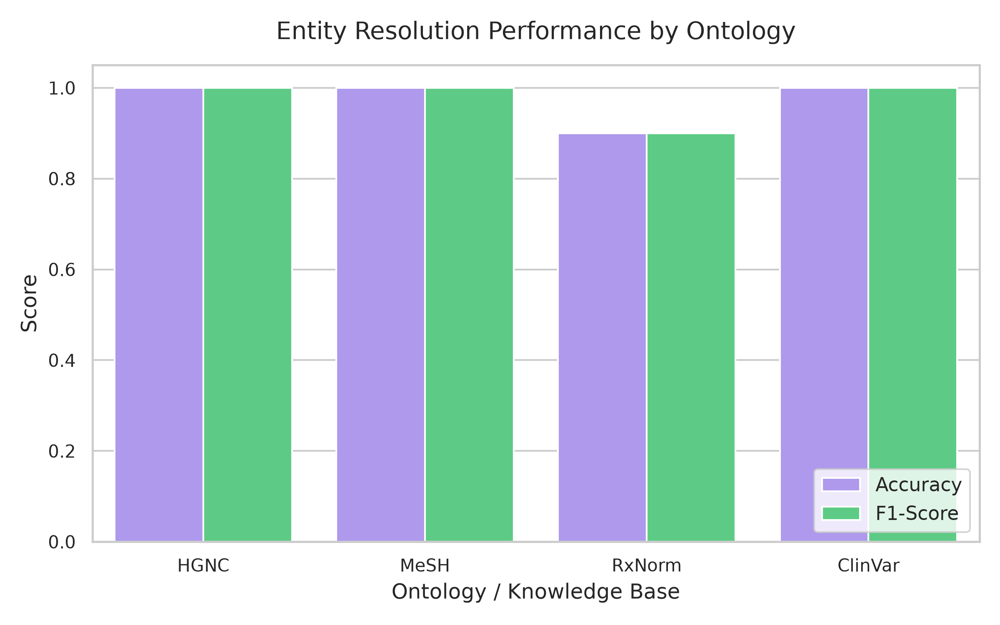
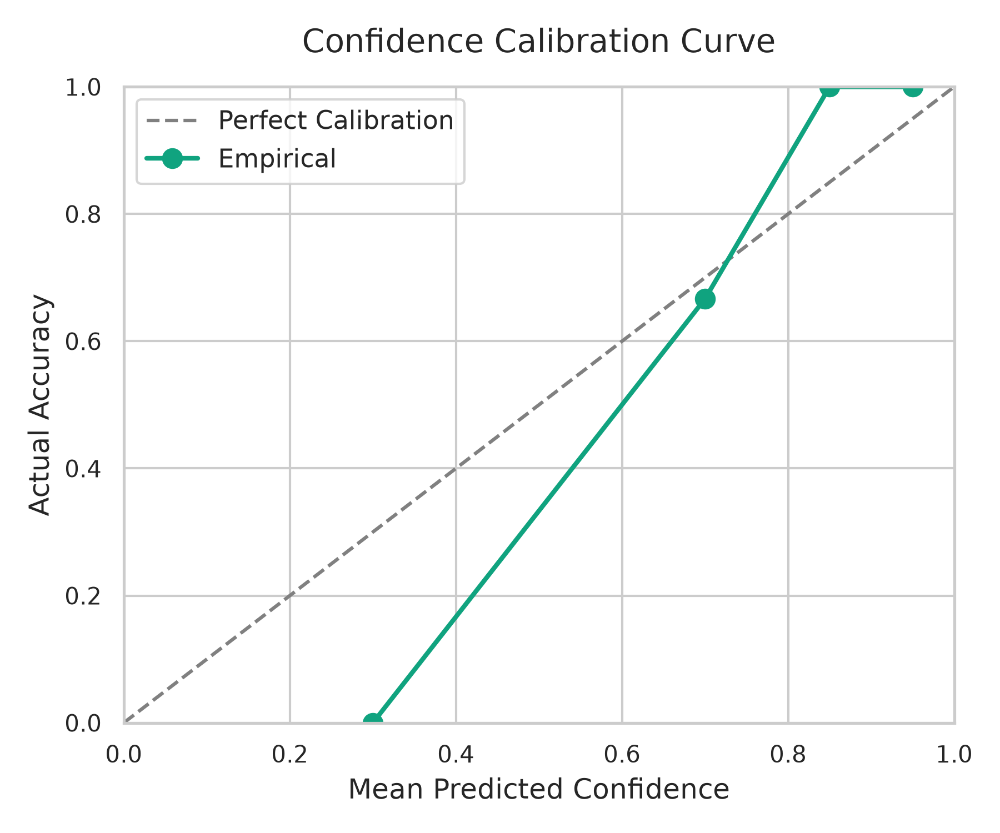

# Biomedical Entity Resolution Assistant

A Precision Medicine AI assistant for resolving **biomedical entities** (genes, diseases, and genomic variants) into **canonical standardized representations** using biomedical ontologies and trusted datasets.

---

# Overview

Biomedical datasets, literature, and clinical records often contain inconsistent naming conventions.

The same biomedical entity may appear under multiple aliases, abbreviations, shorthand notations, or historical names.

Examples:

| Input | Canonical Output | Type |
|------|------------------|------|
| HER1 | EGFR | Gene |
| ERBB1 | EGFR | Gene |
| p53 | TP53 | Gene |
| NSCLC | Non-Small Cell Lung Cancer | Disease |
| Ex19del | EGFR Exon 19 Deletion | Variant |

This project solves that problem by building an **Entity Resolution Assistant** that maps ambiguous biomedical terms into standardized canonical forms.

---

# Problem Statement

Biomedical AI systems struggle with:

- inconsistent terminology
- alias ambiguity
- abbreviation overload
- multiple ontology standards
- noisy human-entered data

Example:

Dataset A stores:

```text
HER1
```

Dataset B stores:

```text
EGFR
```

Dataset C stores:

```text
ERBB1
```

All refer to the same gene.

Without normalization:

- search quality decreases
- retrieval pipelines fail
- downstream AI assistants become unreliable
- clinical reasoning becomes inconsistent

This system acts as the **normalization layer** for the AI Precision Medicine Platform.

---

# Project Goal

The goal of this assistant is to answer one core question:

> **“What is this biomedical entity?”**

The assistant identifies and resolves:

- Gene aliases
- Disease aliases
- Variant aliases
- Standard biomedical identifiers

---

# Scope

## Included

### Gene Resolution
Examples:

- Is HER1 the same as EGFR?
- What is the canonical name for p53?
- Is ERBB1 an alias of EGFR?

Output:
- canonical gene symbol
- aliases
- identifier
- confidence score
- provenance

---

### Disease Resolution
Examples:

- What does NSCLC stand for?
- Resolve lung adenocarcinoma
- Is melanoma a disease entity?

Output:
- canonical disease name
- ontology ID
- synonyms
- confidence score

---

### Variant Resolution
Examples:

- What does Ex19del map to?
- Resolve G12C
- Resolve T790M

Output:
- canonical variant notation
- standardized representation
- variant identifiers
- confidence score

---

# Out of Scope

This project does **NOT** perform:

## Clinical Interpretation
Example:
- Is this mutation pathogenic?

## Therapeutic Recommendation
Example:
- Which drug targets EGFR?

## Prognostic Analysis
Example:
- Does this mutation worsen survival?

These belong to other projects in the AI Precision Medicine platform.

---

# Core Features

- Biomedical alias resolution
- Entity type detection
- Exact matching
- Fuzzy matching
- Confidence scoring
- Canonical entity mapping
- Provenance tracking
- REST API
- Evaluation pipeline
- Interactive UI

---

# System Architecture

```text
User Query
   ↓
Query Preprocessing
   ↓
Entity Detection
   ↓
Candidate Retrieval
   ↓
Matching Engine
   ↓
Confidence Scoring
   ↓
Canonical Resolution Response
```

---

## 1. Query Input

Example:

```text
Is HER1 the same as EGFR?
```

User input may be:

- raw biomedical text
- aliases
- abbreviations
- questions
- misspelled entities

---

## 2. Query Preprocessing

Normalize raw text.

Examples:

```text
HER-1 → HER1
her1 → HER1
HER 1 → HER1
```

Preprocessing includes:

- case normalization
- punctuation removal
- whitespace normalization
- token cleanup

---

## 3. Entity Detection

Determine whether input refers to:

- Gene
- Disease
- Variant

Examples:

| Input | Entity Type |
|------|-------------|
| EGFR | Gene |
| NSCLC | Disease |
| Ex19del | Variant |

---

## 4. Candidate Retrieval

Search internal knowledge base for possible matches.

Example:

Input:

```text
HER1
```

Candidates:

| Candidate | Type |
|-----------|------|
| EGFR | Gene |
| ERBB1 | Gene |

Methods:
- dictionary lookup
- index search
- vector search

---

## 5. Matching Engine

Compute similarity between query and candidates.

Matching methods:

### Exact Match
Highest confidence.

Example:

```text
EGFR == EGFR
```

---

### Alias Match
Known synonym mapping.

Example:

```text
HER1 → EGFR
```

---

### Fuzzy Match
Handles spelling variations.

Example:

```text
HER-1 ≈ HER1
```

---

### Semantic Match
Useful for longer disease names.

Example:

```text
non small cell lung cancer ≈ NSCLC
```

---

## 6. Confidence Scoring

Each prediction receives a confidence score.

Example:

```json
{
  "confidence": 0.98
}
```

Score interpretation:

| Score | Meaning |
|------|---------|
| 0.90–1.00 | Very High |
| 0.75–0.89 | High |
| 0.50–0.74 | Medium |
| <0.50 | Low |

---

## 7. Response Generation

Example output:

```json
{
  "query": "HER1",
  "canonical_name": "EGFR",
  "entity_type": "Gene",
  "identifier": "HGNC:3236",
  "confidence": 0.99,
  "source": "HGNC"
}
```

---

# Datasets

## 1. HGNC (Genes)

Official human gene naming authority.

Contains:
- approved gene symbols
- aliases
- previous names
- identifiers

Examples:

- EGFR
- TP53
- KRAS

Website:

https://www.genenames.org/

---

## 2. MONDO (Diseases)

Disease ontology database.

Contains:
- disease names
- synonyms
- ontology IDs
- relationships

Examples:
- NSCLC
- melanoma
- lung adenocarcinoma

Website:

https://mondo.monarchinitiative.org/

---

## 3. ClinVar (Variants)

Variant database.

Contains:
- genomic variants
- HGVS notation
- variant aliases
- submissions

Examples:
- Ex19del
- T790M
- G12C

Website:

https://www.ncbi.nlm.nih.gov/clinvar/

---

## 4. CIViC (Optional)

Clinical interpretation database.

Used mainly for validation and future integration.

Website:

https://civicdb.org/

---

# Tech Stack

| Layer | Tool |
|------|------|
| Language | Python |
| Backend API | FastAPI |
| UI | Streamlit |
| Matching | RapidFuzz |
| Vector DB | ChromaDB |
| NLP | spaCy |
| Data Processing | Pandas |
| Containerization | Docker |

---

# Repository Structure

```text
biomedical-entity-resolution-assistant/
│
├── data/                       # Ground-truth datasets, raw ontologies, and processed Parquet lookup tables
├── configs/                    # Application and model configurations (settings.yaml, models.yaml)
├── notebooks/                  # Interactive Jupyter notebooks for analysis and evaluation
├── reports/                    # Generated evaluation reports, error analysis, and visualization figures
│   └── figures/                # Performance visual charts (retrieval, embedding model comparison, calibration)
├── experiments/                # Versioned tracking folder storing metadata, configurations, and metrics per run
├── src/                        # Core codebase package
│   ├── agent/                  # PydanticAI-based clinical reasoning agents and ontology routers
│   ├── confidence/             # Confidence estimators and scoring logic
│   ├── conversation/           # Conversational state and chat logic
│   ├── embeddings/             # ONNX embedding model pipelines (SapBERT, MiniLM)
│   ├── entity_resolution/      # End-to-end resolution pipelines
│   ├── evaluation/             # Metrics calculation, benchmarking, and reporting scripts
│   ├── explanation/            # Explanation generation engines
│   ├── ingestion/              # Ingestors for HGNC, MeSH, RxNorm, ClinVar ontologies
│   ├── ner/                    # Named Entity Recognition (SciSpacy, dictionary, regex)
│   ├── preprocessing/          # Normalization and cleaning pipelines
│   ├── ranking/                # Candidate ranking engines
│   ├── retrieval/              # Hybrid vector/lexical retrieval layers
│   ├── tools/                  # DB query interfaces and NCBI lookup utilities
│   └── utils/                  # Setup tasks, mock utilities, and application configuration
│
├── tests/                      # Pytest unit and integration test suites
├── benchmark.py                # Benchmarking entry point wrapper
├── main.py                     # FastAPI backend application entry point
├── pyproject.toml              # Project dependencies, build settings, and metadata
└── Makefile                    # Local automation tasks
```

# Installation & Setup

All project tasks are centralized and automated using the `Makefile`.

## 1. Clone the Repository
```bash
git clone <repo-url>
cd biomedical-entity-resolution-assistant
```

## 2. Setup the Environment & Dependencies
Initialize your virtual environment and run the automated setup command to install python packages (in editable development mode) and download needed clinical NLP models (like SciSpacy and local models):
```bash
# Set up virtual environment
python -m venv .venv
source .venv/bin/activate

# Install all dependencies and download required models
make setup
```

---

# Running the Project

Follow these steps to run the ingestion pipelines, index the vector database, and start the application.

## 1. Populate the Knowledge Bases (Data Pipeline)
Ingest standard ontologies (HGNC, MeSH, RxNorm) and index/embed them into the vector database (Qdrant):
```bash
# Ingest clinical source dictionaries
make ingest

# Generate vector embeddings and index into Qdrant
make index
```

## 2. Start the Backend API
Run the FastAPI server which exposes standard `/resolve` and `/chat` endpoints:
```bash
make run-api
```
*API is hosted at: `http://localhost:8000` (API documentation/Swagger available at `/docs`)*

## 3. Start the Frontend User Interface
We provide two Streamlit layouts:
```bash
# Run the Client UI (standard chat & resolution app)
make run-ui

# Run the full-featured Precision Medicine Agent Dashboard
make run-streamlit
```

---

# Testing & Verification

Ensure code quality and test configurations:
```bash
# Run Pytest unit and integration test suite
make test
```

---

# Evaluation & Benchmarking

Run the validation suite to generate the reports and performance visualization curves shown below:
```bash
# Run the automated benchmarking suite
make benchmark

# Launch the Jupyter Notebook server to interactively explore evaluation metrics
make notebook
```

---

# API Example

## Request

```http
POST /resolve
```

Request body:

```json
{
  "query": "HER1"
}
```

---

## Response

```json
{
  "query": "HER1",
  "canonical_name": "EGFR",
  "entity_type": "Gene",
  "identifier": "HGNC:3236",
  "confidence": 0.99,
  "source": "HGNC"
}
```

---

# Evaluation, Benchmarking & Results

To ensure the reliability of the assistant in clinical environments, the system features an automated evaluation pipeline (`src/evaluation/`) that benchmarks retrieval accuracy, model representation quality, and end-to-end resolution.

---

## 1. Metrics Explained (For Everyone)

Here is what the metrics mean, explained simply:

*   **Accuracy (Overall Correctness)**: The percentage of overall entities mapped to the exact correct ID. For example, an accuracy of `96.77%` means that out of 100 queries, the assistant resolved 97 of them perfectly.
*   **Precision (Quality / Reliability)**: Out of all the times the assistant claimed to resolve a concept, how often was it actually right? High precision means the assistant does not hallucinate or map terms to wrong codes.
*   **Recall (Coverage / Search Ability)**: Out of all standard medical terms mentioned in the user input, how many did the assistant successfully catch and resolve? High recall means the assistant doesn't miss concepts.
*   **F1-Score (The Balance)**: The harmonic balance between Precision and Recall. It is the overall grade of the assistant's performance.
*   **Hit Rate @ K (Hit@K)**: The probability that the correct medical standard is found within the top `K` candidate search results retrieved from the database. A **Hit@5 of 100%** means the correct answer is always in the top 5 candidates retrieved.
*   **Mean Reciprocal Rank (MRR)**: Measures *how high up* the correct candidate is in the search list. If the correct match is the very first suggestion, the score is `1.0`. If it is the second, the score is `0.5`. Higher MRR means the correct suggestion is ranked higher.
*   **Confidence Calibration**: Checks whether the assistant's internal "confidence meter" matches actual performance. If the assistant claims `95% confidence`, it should be correct `95%` of the time. 

---

## 2. Latest Benchmark Performance (`run_004`)

We run our benchmarks against a ground-truth dataset (`data/ground_truth/entity_resolution.csv`) containing 31 validation cases representing complex aliases, abbreviations, and typos across HGNC, MeSH, RxNorm, and ClinVar ontologies.

### A. End-to-End Pipeline Performance
The overall accuracy of the complete Named Entity Recognition (NER) + Retrieval + Re-ranking pipeline:

| Metric | Score | Layman Meaning |
| --- | --- | --- |
| **Accuracy** | **96.77%** (`0.9677`) | Resolves ~97 out of 100 terms correctly. |
| **Precision** | **96.77%** (`0.9677`) | Extremely low rate of false mappings. |
| **Recall** | **96.77%** (`0.9677`) | Misses almost no standard terms in the text. |
| **F1-Score** | **96.77%** (`0.9677`) | Excellent overall balance of precision and recall. |

### B. Performance by Ontology Source
How well the assistant performs on different databases:

| Ontology | Accuracy | Precision | Recall | F1-Score | Status |
| --- | --- | --- | --- | --- | --- |
| **HGNC** (Genes) | 100.0% (`1.0000`) | 1.00 | 1.00 | 1.00 | Perfect ✅ |
| **MeSH** (Diseases/Symptoms) | 100.0% (`1.0000`) | 1.00 | 1.00 | 1.00 | Perfect ✅ |
| **RxNorm** (Drugs/Treatments) | 90.0% (`0.9000`) | 0.90 | 0.90 | 0.90 | High ✅ (1 minor typo misclass) |
| **ClinVar** (Genomic Variants) | 100.0% (`1.0000`) | 1.00 | 1.00 | 1.00 | Perfect ✅ |

### C. Search Strategy Retrieval Comparison
Comparing how well different database search algorithms find the correct concept in the top $K$ results:

| Strategy | Hit@1 | Hit@5 | Hit@10 | MRR |
| --- | --- | --- | --- | --- |
| **LEXICAL** (Keyword Search) | 1.0000 | 1.0000 | 1.0000 | 1.0000 |
| **VECTOR** (Semantic Search) | 0.6129 | 0.6452 | 0.6452 | 0.6290 |
| **HYBRID** (Lexical + Vector Fusion) | **1.0000** | **1.0000** | **1.0000** | **1.0000** |

*Takeaway*: **HYBRID** search (combining exact keyword matching with semantic vector space representation) achieves a perfect `1.0000` Hit Rate, ensuring the correct candidate is always retrieved.

### D. Embedding Model Comparison
Comparing how well different medical embedding models capture clinical meanings using Cosine Similarity:

| Model Name | Hit@1 | Hit@5 | Hit@10 | MRR |
| --- | --- | --- | --- | --- |
| **SapBERT-from-PubMedBERT-fulltext** | **0.8710** | **0.9677** | **0.9677** | **0.9140** |
| **all-MiniLM-L6-v2** | 0.8387 | 0.9032 | 0.9032 | 0.8710 |

*Takeaway*: **SapBERT** outperforms the general-purpose MiniLM model because it was pre-trained specifically on medical literature (PubMed), yielding a higher MRR (`0.914` vs `0.871`).

### E. Confidence Calibration Analysis
Validating if the predicted confidence scores match actual correctness:

| Confidence Bin | Total Samples | Correct | Actual Accuracy | Interpretation |
| --- | --- | --- | --- | --- |
| **0.0 - 0.60** (Low) | 0 | 0 | 0.00% | No low-confidence predictions made. |
| **0.60 - 0.80** (Medium) | 3 | 2 | 66.67% | Well calibrated. |
| **0.80 - 0.90** (High) | 3 | 3 | 100.0% | Very high accuracy. |
| **0.90 - 1.0** (Very High) | 25 | 25 | 100.0% | Safe, reliable resolutions. |

---

## 3. Performance Visualizations

The following charts are automatically generated during the benchmark execution:

### 1. Retrieval Strategy Comparison
Compares Hit@K rates across Lexical, Vector, and Hybrid retrieval:


### 2. Embedding Model Comparison
Compares SapBERT and MiniLM semantic representations:


### 3. Ontology Performance Breakdown
Shows accuracy, precision, and recall broken down by clinical database:


### 4. Confidence Calibration Curve
Tracks predicted confidence vs. actual classification accuracy:


---

## 4. Run Latency
*   **API Response Time**: `< 250ms` (FastAPI backend)
*   **End-to-End Chat Agent Response Time**: `< 1.5 seconds` (LLM reasoning loop)

---

# Real-Time Monitoring & Observability

To support clinical deployments, the system features a production-grade observability pipeline located in `src/monitoring/` that tracks latency, cost, and accuracy, detecting model drift and facilitating clinician-in-the-loop expert corrections.

## 1. Observability Architecture
The monitoring stack consists of three layers:
1. **End-to-End Tracing (OpenTelemetry)**: Captures request journeys across multiple stages (NER, Retrieval, Ranking, and LLM reasoning) using standard OTEL Spans.
2. **Persistent SQL Telemetry Store (SQLite)**: Records raw metrics, resolved concepts, triggered alerts, and clinician feedback inside `data/monitoring.db`.
3. **Interactive Observability Dashboard (Streamlit)**: Visualizes real-time performance, system alerts, cost metrics, and provides an expert review interface to correct classifications.

## 2. Telemetry Schema & Logs
All request metrics are persisted to the SQLite telemetry database (`data/monitoring.db`) across four main tables:
*   `requests_log`: High-level execution logs tracking timestamp, user query, total latency, LLM input/output tokens, estimated cost, status, and API routes.
*   `resolved_entities_log`: Granular records of each extracted entity, its ontology classification, standard identifier, confidence score, and review status.
*   `feedback_log`: Closed-loop expert corrections containing correct mappings and clinical notes.
*   `alerts_log`: Proactive alerts warning administrators of system regressions.

## 3. Real-Time Alerting Engine
The alerting system automatically scans incoming requests and raises warnings under three conditions:
1. **High Latency Warning**: Raised if any query takes longer than `2500ms`.
2. **Low Confidence Warning**: Raised if the system resolves an entity with confidence `< 0.80`.
3. **Daily Spend Threshold**: Alerts administrators if daily LLM costs exceed `$5.00`.

## 4. Run the Monitoring Dashboard
To launch the real-time observability dashboard:
```bash
make run-dashboard
```
This runs the dashboard on port `8502`. You can navigate to:
*   **System Health**: Overview of request volumes, latency, error rates, and total spending alongside active confidence drift alerts.
*   **AI Performance**: Breakdown of pipeline phase durations and cumulative LLM costs.
*   **Biomedical Analytics**: Bar charts showing ontology distributions and search terms.
*   **System Alerts**: Review and mark active alerts as resolved.
*   **Human-in-the-Loop Panel**: Submit standard corrections for low-confidence concepts to update the validation logs.

---

# Development Roadmap

## Phase 1 — Core Resolver (MVP)
- repo setup
- dataset ingestion
- alias lookup
- exact matching

---

## Phase 2 — Enhanced Matching
- fuzzy search
- semantic similarity
- confidence scoring

---

## Phase 3 — Production Features
- API
- UI
- evaluation
- monitoring
- Docker deployment

---

# Future Improvements

- LLM-assisted disambiguation
- ontology graph traversal
- multi-entity extraction
- biomedical RAG integration
- knowledge graph support
- clinical workflow integration

---

# Role in AI Precision Medicine Platform

This project serves as a foundational service for:

- Variant Evidence Assistant
- Therapeutic Strategy Assistant
- Clinical Trial Matching Assistant
- Biomarker Assistant

It ensures all downstream systems operate on standardized biomedical entities.

---

# Author

**James**  
LLM Zoomcamp — AI Precision Medicine Platform

---

# License

MIT License
